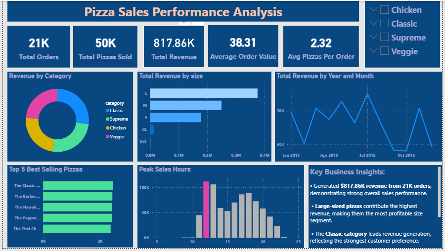

# Pizza Sales Performance Analysis

SQL | MySQL | Power BI | Data Analytics

## About the Project

This project was created to analyze pizza sales data using SQL and Power BI. The goal was to understand sales performance, customer ordering behavior, popular pizza categories, and revenue trends.

By performing SQL analysis and building an interactive dashboard, meaningful business insights were identified to support decision-making.

---

## Business Objectives

* Find the total number of orders and total revenue.
* Analyze customer purchasing patterns.
* Identify the best-selling pizzas.
* Determine the most popular pizza sizes.
* Compare sales across pizza categories.
* Analyze sales trends by time and date.
* Generate business insights from the data.

---

## Business Questions

* How many orders were placed?
* What is the total revenue generated?
* Which pizza has the highest price?
* Which pizza size is ordered the most?
* What are the top 5 best-selling pizzas?
* Which pizza category sells the most?
* At what time do customers place the most orders?
* How much revenue does each category contribute?
* How does revenue change over time?
* Which pizzas generate the highest revenue?

---

## Tools Used

* MySQL
* Power BI
* PowerPoint
* GitHub

---

## Skills Demonstrated

* SQL Joins
* Aggregate Functions
* Window Functions
* Data Cleaning
* Data Validation
* Revenue Analysis
* Trend Analysis
* KPI Reporting
* Dashboard Design
* Business Insight Generation

---

## Dataset

The dataset contains four tables:

| Table         | Description                                       |
| ------------- | ------------------------------------------------- |
| orders        | Stores order date and time information            |
| order_details | Stores pizza quantities ordered                   |
| pizzas        | Contains pizza sizes and prices                   |
| pizza_types   | Contains pizza names, categories, and ingredients |

---

## Key Performance Indicators (KPIs)

| KPI                      | Value    |
| ------------------------ | -------- |
| Total Revenue            | $817.86K |
| Total Orders             | 21,350   |
| Total Pizzas Sold        | 49,574   |
| Average Order Value      | $38.31   |
| Average Pizzas Per Order | 2.32     |

---

## SQL Analysis Performed

* Data Cleaning
* NULL Value Checks
* Duplicate Checks
* Data Validation
* Revenue Analysis
* Sales Analysis
* Category Analysis
* Size Analysis
* Time-Based Analysis
* Cumulative Revenue Analysis

---

## Dashboard

The Power BI dashboard includes:

* Revenue KPIs
* Revenue by Category
* Revenue by Pizza Size
* Monthly Revenue Trend
* Top 5 Best-Selling Pizzas
* Peak Sales Hours
* Key Business Insights

Dashboard Screenshot:



---

## Key Insights

* The business generated more than $817K in revenue.
* Large-sized pizzas contributed the highest revenue.
* The Classic category had the highest sales volume.
* Customer orders were highest during lunch and evening hours.
* Thai Chicken Pizza generated the highest revenue.
* A small number of pizza types contributed a large share of total revenue.

---

## Project Structure

```text
pizza-sales-performance-analysis
│
├── Dataset
│   ├── orders.csv
│   ├── order_details.csv
│   ├── pizzas.csv
│   └── pizza_types.csv
│
├── SQL Queries
│   └── pizza_sales_analysis.sql
│
├── Dashboard
│   └── pizza_sales_dashboard.pbix
│
├── Images
│   └── dashboard_overview.png
│
├── Presentation
│   └── Pizza_Sales_Analysis_Presentation.pptx
│
└── README.md
```

## Author

**Murasoli**

Aspiring Data Analyst passionate about SQL, Power BI, Excel, and Python.

This project demonstrates end-to-end data analysis, dashboard development, and business insight generation using real-world sales data.
